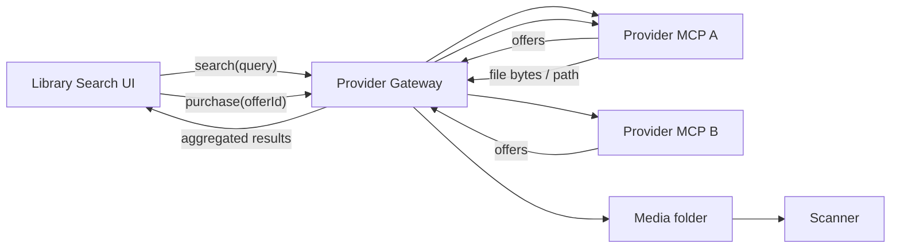

# External song providers via MCP configs

> Design-only. Not implemented yet.

## Overview

Provider-agnostic framework so Karaoke Eternal can search external song catalogs, confirm purchase, and download into the local library—without the app knowing any vendor’s purchase mechanics. Each vendor is a drop-in MCP-backed provider defined by config. The sample MCP is fully simulated (no real public purchase API required).

## Goal

When a song isn’t found (or is weakly matched) locally, the app can **search all configured providers**, show offers, and let an admin **confirm purchase + download**. Karaoke Eternal never embeds vendor checkout logic; that lives in per-provider MCP servers described by config.



## Design principles

- **App owns UX + orchestration only**: query fan-out, result ranking, confirm dialog, write into a media path, trigger scan.
- **Provider owns vendor mechanics**: login, catalog search, cart/checkout, download URL/file retrieval.
- **Config = new provider**: dropping a provider package registers it; no app code change required for a new vendor.
- **Secrets stay out of git**: usernames/API keys/session tokens in an encrypted local vault or env references—not in the checked-in MCP template. **Do not store raw credit card PAN/CVV** in the app or provider configs; purchase flows should use the vendor’s own saved payment method, a one-time browser/checkout handoff, or a token the vendor already issued.

## Capability modes (important)

Public karaoke vendor APIs that go **search → charge → download** end-to-end are rare. The contract therefore supports tiers so the framework is useful before (or without) a full-purchase API:

| Capability | Provider can | App UI |
|------------|--------------|--------|
| `search_only` | Return catalog offers | Link/open vendor page; no in-app buy |
| `checkout_handoff` | Search + return a checkout/download URL | “Buy on site” opens URL; later “I’ve downloaded — import folder” or poll for file |
| `purchase_download` | Search + complete buy + write files | Confirm purchase & download (full automation) |

`provider.json` declares `capabilities: string[]`. The gateway only offers buttons the provider supports. Real vendors will often land on **handoff** first; full automation is optional.

## Why MCP (and how we use it)

MCP is a good **plugin transport** (stdio/process isolation, typed tools, independent deploy). Karaoke Eternal would run a small **Provider Gateway** that speaks MCP client → provider servers (same pattern Cursor uses), not that the karaoke UI becomes an AI agent.

Stable tool contract:

| Tool | Purpose |
|------|---------|
| `search_songs` | `{ query }` → offers (title, artist, price?, format, providerOfferId, capability hints, checkoutUrl?) |
| `get_offer` | optional detail / license notes |
| `purchase_and_download` | only if `purchase_download`; `{ offerId, confirmToken, outputDir }` → files on disk |
| `begin_checkout` | only if `checkout_handoff`; returns URL / instructions |
| `health` / `auth_status` | connected? credentials valid? |

The app never learns “click Add to Cart then Pay”; it only calls these tools.

## Sample MCP: fully simulated (no vendor API)

**Do not block the framework on finding a public purchase API.** Ship a **demo provider** that implements `purchase_download` entirely offline:

- **Catalog**: static fixture JSON (e.g. 20 fake songs matching common queries)
- **“Purchase”**: no payment; on confirm, copy bundled sample `.mp3`+`.cdg` (or tiny generated placeholders) into the gateway `outputDir` with a filename derived from the offer
- **Auth**: fake `username`/`password` in vault so the secrets UX can be tested; `auth_status` checks they’re set
- **Optional second demo**: `checkout_handoff` stub that returns a `file://` or docs URL, to exercise the handoff UI path

This proves gateway + UI + scan ingest without depending on any manufacturer.

## Provider package layout

```text
providers/
  demo-karaoke/           # simulated sample MCP
    mcp.json
    provider.json         # capabilities: ["purchase_download"]
    fixtures/catalog.json
    fixtures/sample.mp3
    fixtures/sample.cdg
    README.md
  ...
```

`mcp.json` shape:

- `command` / `args` / `env` (env values are **references** like `vault:demo.password`, not literals)
- optional `cwd`

A **template generator** (later) scaffolds new packages. Real providers will typically implement **search + handoff** (session cookie / private HTML or undocumented APIs)—not a public Stripe-like purchase API. Document that expectation in the template README so contributors don’t assume public checkout APIs exist.

## App-side pieces (Karaoke Eternal)

Fit into today’s local-only flow (`src/routes/Library/selectors/getSearchResults.ts`, media paths + scanner):

1. **Provider Gateway** (server): discover `providers/*/mcp.json`, spawn/connect MCP clients, fan-out `search_songs`, normalize offers, route confirm to `purchase_and_download` or `begin_checkout` by capability.
2. **API / socket actions** (admin-gated):
   - `externalSearch(query)`
   - `externalPurchase({ providerId, offerId })` → confirm → download → media path → `requestScan`
   - `externalBeginCheckout(...)` for handoff providers
3. **Library UI**: empty/weak local results → external search; results grouped by provider; button label follows capability (“Download”, “Buy on site”, “View listing”).
4. **Prefs**: enabled providers, downloads target path, vault UI for declared secrets.

Import reuses existing ingest: write into a watched/scanned folder → `server/Scanner/FileScanner/FileScanner.ts`—no remote-only library rows.

## Credential model

- Provider declares required secret keys in `provider.json` (`username`, `apiKey`, `sessionCookie`, …).
- App stores values in a **local encrypted secrets store**, injects as env when launching that MCP.
- Purchase confirmation is always an explicit admin action (no silent buys).
- Interactive checkout (CAPTCHA, 3DS) → provider returns `needs_user_interaction` + URL; app does not automate card entry.

## Phased delivery (when building)

1. **Contract + simulated demo provider** — schema with capabilities, gateway, demo MCP, UI stub, download-to-folder + scan.
2. **Secrets + admin prefs** — vault, enable/disable providers, downloads path; exercise with demo auth.
3. **Handoff UX** — second demo or first real vendor that only searches + opens checkout URL (no public purchase API needed).
4. **Provider template tooling** — scaffold MCP package; document handoff-first as the realistic path for most vendors.
5. **Optional later** — any vendor that *does* expose or privately allow automated purchase can implement `purchase_download` without app changes.

## Explicit non-goals (v1)

- Waiting on a public vendor purchase API before building the framework
- Embedding vendor HTML scrapers inside the Karaoke Eternal process
- Storing or transmitting raw card numbers
- Mixing unpaid/pirated catalog sources into the product surface
- Pushing remote-only titles into the socket library before files exist on disk

## Planned work items

- [ ] Define MCP tool schema + offer DTO with capability modes (`search_only`, `checkout_handoff`, `purchase_download`)
- [ ] Provider Gateway: discover `providers/*/mcp.json`, fan-out search, capability-aware purchase orchestration
- [ ] Fully simulated sample MCP (fixture catalog + fake purchase copying sample media)—no real vendor API
- [ ] Library UI empty-search hook, admin confirm, handoff vs in-app purchase UX, download path + scan
- [ ] Encrypted secrets vault + provider-declared credential keys (no PAN/CVV)
- [ ] Later: provider scaffold/template; real vendors likely use handoff or private/session APIs, not public purchase APIs
